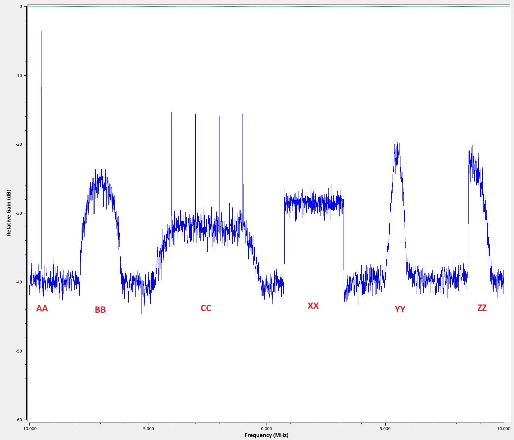

# Signal Identification Challenge

## Description
```ctf_sigid_flag``` is a binary IQ file recorded by a radio monitoring a span of radio frequency (RF) spectrum. You have been tasked with identifying the type of modulation used to transmit each signal. 

Pre-analysis has determined that there is six signals (3 continuous/analogue and 3 discrete/digital) in total and could potentially be the following modulations:
 * **AMDSB**    (Amplitude modulation double side band)
 * **OOK**      (On-Off Keying)
 * **PSK**      (Phase shift Keying)
 * **FM**       (Frequency Modulation)
 * **AMSSB**    (Amplitude modulation single Side Band)
 * **FHSS**     (Frequency hopping Spread spectrum)
 * **CW**       (Continuous Wave - Tone)
 * **FSK**      (Frequency shift Keying)
 * **OFDM**     (Orthogonal Frequency division multiplexing)
 * **DSSS**     (Direct Sequence spread spectrum)

Open the ```ctf_sigid_flag``` file using one of the suggested tools and use you RF analysis skills to identify all the signals to create the flag.

Flag format: flag{AABBCCXXYYZZ} - where AA, BB, CC, XX, YY, ZZ represent the signals' modulation acronym (as noted above).

### Frequency Spectrum

## Waterfall Plot (frequency/time)


## Suggested tools:
 * [Inspectrum](https://github.com/miek/inspectrum)
 * [Universal Radio Hacker](https://github.com/jopohl/urh)
 * [GNURadio](https://github.com/ryanvolz/radioconda) (Advanced usage)

## Notes:
 * Try viewing the waveforms from the frequency and waterfall perspective to help determine what type of modulation is being used.
 * There are only three attributes that can be used to modulate a signal - Amplitude, Frequency, and Phase.
 * The signals have been created using random data i.e. there is no identifying information in the demodulated data.
